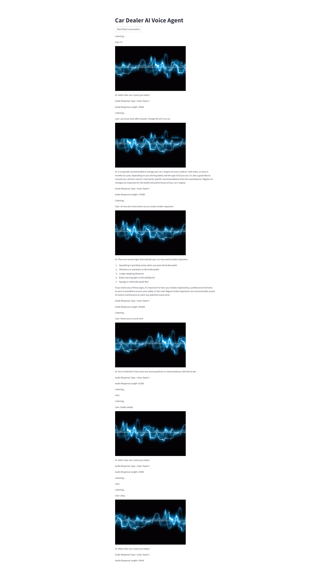

# AI Auto Assistant

This project is a voice-based AI agent designed for a car dealership. The AI agent can interact with users via voice commands, respond using natural language, and provide continuous speech-to-speech conversations. The system uses Google Cloud's Speech-to-Text and Text-to-Speech services, OpenAI's GPT-3.5-turbo for generating responses, and Streamlit for the user interface.


## Table of Contents
* **Features**
* **Prerequisites**
* **Installation**
* **Configuration**
* **Usage**
* **Project Structure**
* **Modules Description**
* **License**

## Features
* Continuous voice-based interaction without requiring manual intervention between responses.
* Uses Google Cloud for speech recognition and text-to-speech synthesis.
* Incorporates OpenAI's GPT-3.5-turbo to generate natural language responses.
* Implements a turn-taking model using sentiment analysis to decide when the AI should respond.
* Provides a visual indicator while the AI is responding.

## Prerequisites
* Python 3.8 or later
* Google Cloud account with Speech-to-Text and Text-to-Speech APIs enabled
* OpenAI API key
* FFmpeg installed and accessible from the command line

## Installation

1. Clone the Repository
```bash
       git clone https://github.com/presiZHai/ai-auto-assistant.git

       cd ai-auto-assistant
```
2. Create and Activate a Virtual Environment

```bash
        conda create --name voice-auto-assistant python=3.10 -y

        conda activate voice-auto-assistant
```
3. Install Required Packages

```bash
        pip install -r requirements.txt
```

## Configuration

1. Set Up Environment Variables

Create a .env file in the project root directory with the following content:
```bash
        OPENAI_API_KEY=your_openai_api_key

        GOOGLE_APPLICATION_CREDENTIALS_PATH=path_to_your_google_service_account_json
```

2. Obtain API Keys

* Google Cloud: Create a service account, enable Speech-to-Text and Text-to-Speech APIs, and download the service account key file in JSON format. Set the path to this file in the .env file as GOOGLE_APPLICATION_CREDENTIALS_PATH.
* OpenAI: Sign up at OpenAI and get your API key. Set it as OPENAI_API_KEY in the .env file.

## Usage

1. Run the Application

```bash
        streamlit run main_app.py
```

2. Start or Stop the Conversation

* Click the "Start/Stop Conversation" button to begin or end the voice interaction.




## Project Structure

* main_app.py: The main Streamlit application that handles the user interface and orchestrates the interaction loop.
* stt_module.py: Speech-to-Text module that transcribes user input using Google Cloud's Speech-to-Text API.
* tts_module.py: Text-to-Speech module that converts AI responses to audio using Google Cloud's Text-to-Speech API.
* llm_module.py: Language model module that generates responses using OpenAI's GPT-3.5-turbo.
* turn_taking_model.py: Turn-taking module that decides if the AI should respond based on sentiment analysis.
* requirements.txt: List of Python dependencies required for the project.
* .env: Environment file to store sensitive API keys.

## Modules Description

1. stt_module.py
Handles audio transcription using Google Cloud's Speech-to-Text API. This module includes:
* convert_audio: Converts input audio files to the required format (16kHz, mono, WAV).
* transcribe: Transcribes the audio content into text.

2. tts_module.py
Generates spoken responses from text using Google Cloud's Text-to-Speech API. This module includes:
* synthesize_speech: Takes input text and returns the audio content in MP3 format.

3. llm_module.py
Uses OpenAI's GPT-3.5-turbo to generate conversational responses. This module includes:
* generate_response: Generates a response based on the user's input prompt.

4. turn_taking_model.py
Implements a turn-taking model using a sentiment analysis pipeline to decide if the AI should respond. This module includes:
* should_respond: Determines if the AI should respond based on silence duration and sentiment score.

5. main_app.py
The main application script that:
* Initializes the modules.
* Records audio from the user.
* Transcribes the audio, generates a response, and synthesizes speech.
* Manages the conversation flow and displays the conversation history.

## License

This project is licensed under the MIT License. See the LICENSE file for more information.